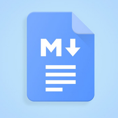

  <a href="https://github.com/markdown-docs/mds-backend">
    <picture>
      
    </picture>
<h1 align="center">
    Markdown docs backend
</h1>

  </a>

  
 

  

To start developement server:

- Run `mix setup` to install and setup dependencies
- Run `mix dev` to start Phoenix server `iex -S mix phx.server`

Now you can visit [`localhost:4000`](http://localhost:4000) from your browser.

Ready to run in production? Please
[check our deployment guides](https://hexdocs.pm/phoenix/deployment.html).

## Learn more

- Official website: https://www.phoenixframework.org/
- Guides: https://hexdocs.pm/phoenix/overview.html
- Docs: https://hexdocs.pm/phoenix
- Forum: https://elixirforum.com/c/phoenix-forum
- Source: https://github.com/phoenixframework/phoenix
